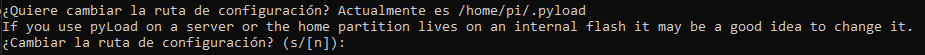
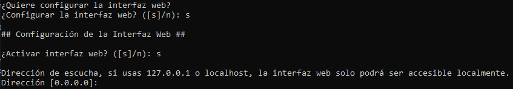
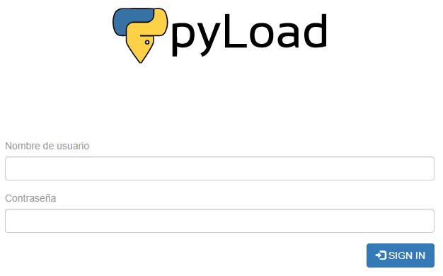

# <div align="center">
<p align="center">

</p>

# <div align="center">Instalar Pyload en Raspberry Pi
  La instalación que se muestra a continuación es para <a href="https://downloads.raspberrypi.org/raspios_lite_armhf/release_notes.txt" target="_blank">Raspberry OS 2021-10-30</a> (Debian 11).
  
  ## Comandos: ##
* Paso 1: Crear directorio de Pyload y darle permisos al mismo.
```bash 
mkdir /Pyload | sudo chown -R pi:pi /Pyload
```
  
* Paso 2: Entrar en el directorio.
```bash 
cd /Pyload
```
* Paso 3: Descagar Pyload y librerias necesarias (python-pycurl & python-crypto).
```bash 
wget https://github.com/pyload/pyload/archive/refs/tags/v0.4.20.zip http://ftp.us.debian.org/debian/pool/main/p/pycurl/python-pycurl_7.43.0-2_armhf.deb http://ftp.us.debian.org/debian/pool/main/p/python-crypto/python-crypto_2.6.1-9+b1_armhf.deb
```
* Paso 4: Instalar librerias
```bash
sudo apt install ./python-crypto_2.6.1-9+b1_armhf.deb ./pyload-cli_0.4.20_all.deb -y
``` 
* Paso 5: Instalar Pyload.
```bash
unizp v0.4.20.zip | cd /pyload-0.4.20
```
* Paso 6: Crear servicio.
```bash
sudo nano /etc/systemd/system/pyload.service
```
* Paso 7: Editar servcio (Pegamos todo lo que esta a continuación).
```bash
[Unit]
Description=Python Downloader
After=network.target

[Service]
User=pi
ExecStart=python2.7 /Pyload/pyload-0.4.20/pyLoadCore.py

[Install]
WantedBy=multi-user.target
```
* Paso 8: Configurar Pyload.
```bash
/pyload-0.4.20/PyloadpyLoadCore.py -s
```

- Recomiendo dejar por defecto la ruta de configuración (/home/pi/.pyload)
<p align="center"></p>
  
- Active la interfaz web y ponga la dirección 0.0.0.0, si no podra ingresar desde su red.
<p align="center"></p>
  
* Paso 9: Recargar el deominio
```bash
sudo systemctl daemon-reload
```
* Paso 10: Iniciar el servicio
```bash
sudo systemctl start pyload
```
* Paso 11: Iniciar servicio al comienzo del sistema
```bash
sudo systemctl enable pyload
```
* Paso 12: Acceda a la web http://ip_de_raspberry:8000
<p align="center"></p>
