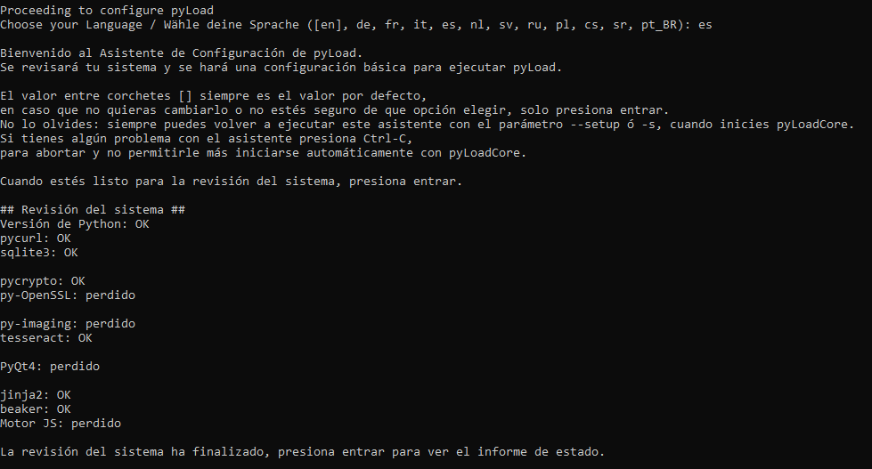

# <div align="center">
<p align="center">

</p>

# <div align="center">Instalar Pyload en Raspberry Pi
  La instalación que se muestra a continuación es para Debian 11.
  
* Paso 1: Crear directorio de Pyload y darle permisos al mismo 
* Paso 2: Entrar en el directorio
* Paso 3: Descagar Pyload y librerias necesarias.
* Paso 4: Instalar librerias y Pyload
  
  ## Comandos ##
```bash 
mkdir /Pyload | sudo chown -R pi:pi /Pyload
cd /Pyload
wget https://github.com/pyload/pyload/releases/download/v0.4.20/pyload-cli_0.4.20_all.deb http://ftp.us.debian.org/debian/pool/main/p/pycurl/python-pycurl_7.43.0-2_armhf.deb http://ftp.us.debian.org/debian/pool/main/p/python-crypto/python-crypto_2.6.1-9+b1_armhf.deb
sudo apt install ./python-pycurl_7.43.0-2_armhf.deb ./python-crypto_2.6.1-9+b1_armhf.deb ./pyload-cli_0.4.20_all.deb -y
```
  ## Aclaraciones ##
- Es preferible instalarlo en el directorio /Pyload y que la configuración tambien este alojada ahi, si no al tiempo por problemas de permisos el sistema los cambia y el servicio no se inicia.
- Una vez instalado se debe seguir el asistente:
  # <div align="center">
<p align="center">

</p>
  
- Una vez finalizado el asistente accederas a la web http://ip_de_raspberry:8000
